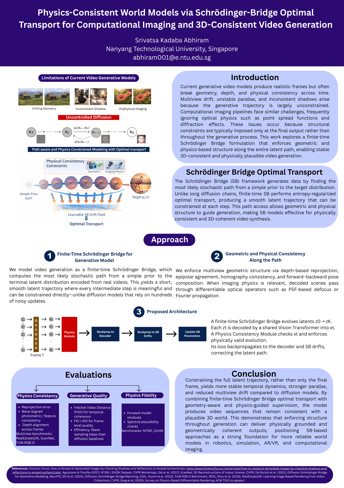

# Physics-Consistent World Models via Schrödinger Bridge Optimal Transport

**Accepted to the 40th AAAI Conference on Artificial Intelligence (AAAI 2026)**

📄 **Paper (PDF):** [Download paper](https://ojs.aaai.org/index.php/AAAI/article/view/42325/46286)  
🖼️ **Poster (PDF):** [Download poster](https://ojs.aaai.org/index.php/AAAI/article/view/42325/46820)

---

## Poster



---

## Abstract

Current generative video models produce realistic frames but often break geometry, depth, and physical consistency across time. This work explores a finite-time Schrödinger Bridge formulation that enforces geometric and physics-based structure along the entire latent path, enabling stable 3D-consistent and physically plausible video generation.

## Citation

```bibtex
@inproceedings{abhiram2026physics,
  title     = {Physics-Consistent World Models via Schrödinger Bridge Optimal Transport},
  author    = {Srivatsa Kadaba Abhiram},
  booktitle = {Proceedings of the 40th AAAI Conference on Artificial Intelligence},
  year      = {2026}
}
```

